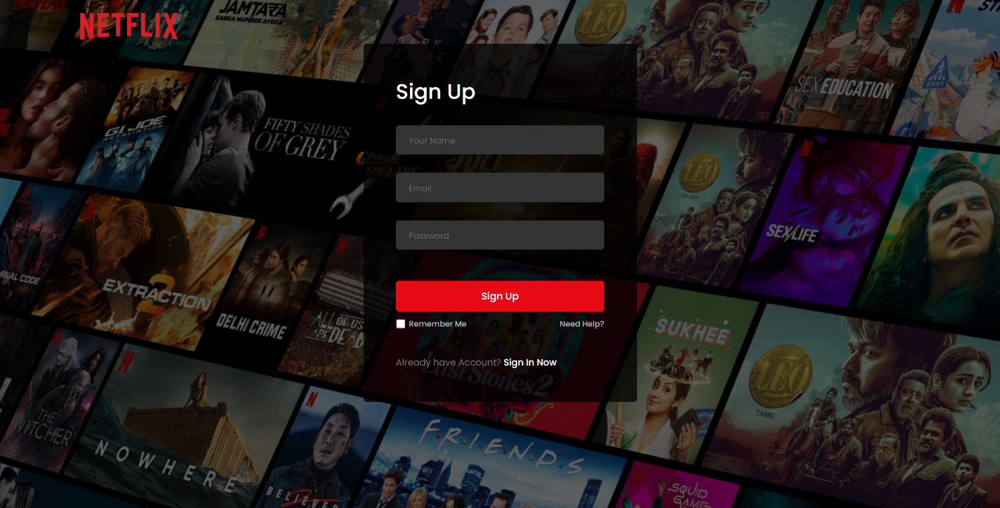

# 🎬 Netflix Clone


A frontend fully clone of Netflix built using web technologies, with responsive UI.  
Visit live demo: [ar-netflix-clone.vercel.app](https://ar-netflix-clone.vercel.app)  

---

## Demo / Screenshots

**Home / Browse Page**  


**Login Page**  
  

---

##  Project Structure

```

Netflix-Clone/
├── img/                    # screenshots or assets (for README, etc.)
├── index.html              # main front page (browse / home view)
├── login.html (or part of SPA routing)  # login interface
├── style.css               # styling & layout rules
└── script.js                # JavaScript logic (data fetch, UI, login flow)

````

### File Descriptions
- **index.html** — the main browsing interface with movie lists  
- **login.html / login route** — user login interface  
- **style.css** — styles, layout, responsive rules  
- **script.js** — JS for UI interactivity, login handling, data fetching  
- **img/** — images/screenshots used in README / documentation  

---

##  Technologies Used

- HTML5  
- CSS3   
- JavaScript   
- React.js  

---

##  Key Features

- Fully responsive design across various screen sizes  
- User login page with form inputs (email/password)  
- Navigation / routing between login and browse / home views  
- Display of movie cards / sections  
- UI interactivity (hover effects, card expansions, etc.)  
- A clean, Netflix-inspired layout  

---

##  Home Page Details

The **Home Page** (`index.html`) replicates Netflix’s familiar browsing experience.  
Key highlights:
- A **hero section** with background banners and movie titles  
- Multiple **movie category sections** (e.g., Trending, Top Picks, New Releases)  
- **Horizontal scroll animations** and hover effects on movie thumbnails  
- A top **navigation bar** with logo and menu options  
- **Fully responsive design** that adapts perfectly across all devices — from large screens to mobile phones 📱💻  

---

## Login Page Details

The **login page** is a dedicated route/section — typically reached at `/login` — that allows users to enter credentials. Features include:

- Input fields for email and password  
- Form validation (checking required fields)  
- Submit / login button  
- Link to home / browse if login successful  
- Clean layout consistent with the rest of the UI  

In your live app, navigating to:  
`https://ar-netflix-clone.vercel.app/login`  
should show the login interface.  

---

## Getting Started (Local Setup)

1. Clone this repository  
   ```bash
   git clone https://github.com/Rahumansgit/Netflix-Clone.git
````

2. Change into project folder

   ```bash
   cd Netflix-Clone
   ```

3. Open `index.html` (or run a simple HTTP server)

   ```bash
   # e.g. with Python
   python3 -m http.server
   # or using Live Server in VSCode
   ```

4. Navigate to `/login` route to test login page
   Example: `http://localhost:8000/login.html` (or route)

---
````
## 🤝 Contributing

I welcome suggestions, improvements, bug fixes, and feature additions!
Things you could help with:

* Add authentication logic (connect backend)
* Dynamically fetch real movie data (e.g. via TMDB API)
* Add signup / registration page
* Add “watchlist”, “favorites”, “playback” features
* Improve UI/UX, transitions, animations
* Add error states, loading indicators, etc.

---
