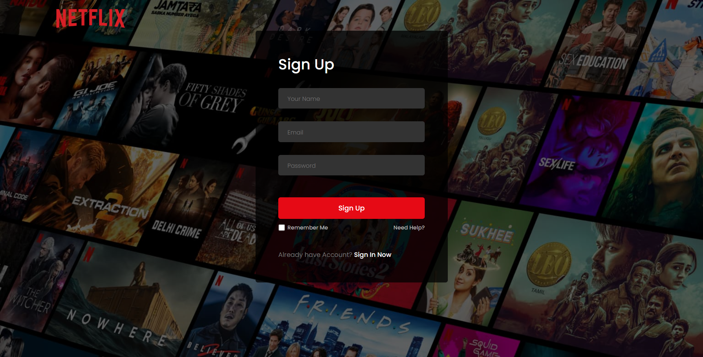

# 🎬 Netflix Clone — Streaming Platform UI


A **Netflix-inspired streaming web application UI** built using **React.js, React Router DOM, and Vite**.

This project replicates the core UI structure of Netflix including home page, login page, movie browsing sections, and video player page.

🌐 **Live Demo:** [https://ar-netflix-clone.vercel.app/](https://ar-netflix-clone.vercel.app/)
🔐 **Login Page:** [https://ar-netflix-clone.vercel.app/login](https://ar-netflix-clone.vercel.app/login)

---

## 📸 Screenshots

### 🏠 Home Page


### 🔐 Login Page



---

## Project Purpose

This project was built to:

* Strengthen my **React.js and JavaScript** skills
* Practice **multi-page routing using React Router DOM**
* Understand how streaming platforms structure UI layouts
* Improve component-based architecture and reusable UI sections

It is a **frontend-only project** focused on UI and layout replication.

---

## Features

### Home Page

* Hero banner section
* Movie category rows using reusable TitleCards component
* Netflix-style navigation bar
* Profile, notification, and search UI icons
* Structured and modern content layout

### Login Page

* Styled login form UI
* Netflix-themed layout
* Responsive design

### Player Page

* Dedicated video playback page
* Back navigation arrow
* Embedded video section

---

## Routing

Implemented using **React Router DOM**:

* `/` → Home
* `/login` → Login
* `/player` → Player

---

## Responsiveness

The application is fully responsive and optimized for:

* Desktop
* Tablet
* Mobile

Layout elements adapt smoothly across screen sizes to ensure a consistent user experience.

---

## Tech Stack

* **React 19**
* **React Router DOM 7**
* **JavaScript (ES6+)**
* **Vite**
* **Custom CSS**
* **Vercel (Deployment)**

---

## Run Locally

Clone the repository:

```bash
git clone https://github.com/Rahumansgit/Netflix-Clone.git
```

Install dependencies:

```bash
npm install
```

Run development server:

```bash
npm run dev
```

---

## What I Learned

* Structuring scalable React applications
* Creating reusable components
* Implementing page routing
* Designing complex UI layouts
* Managing project assets efficiently

---
